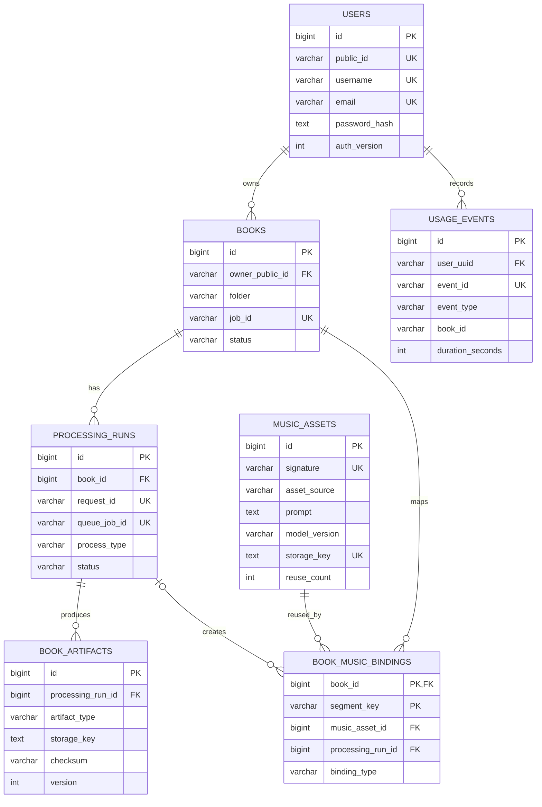

# EBookStudio 데이터베이스 설계

## 1. 설계 기준

EBookStudio는 데이터의 수명과 처리 방식에 따라 저장소를 분리합니다.

- PostgreSQL은 계정, 책 카탈로그, 처리 이력, 음악 자산과 사용량처럼 관계 무결성과 장기 보존이 필요한 서비스 데이터를 소유합니다.
- SQLite `jobs.db`는 한 Docker 호스트 안에서 Spring과 Python Worker가 함께 사용하는 작업 큐, Worker heartbeat와 음악 프롬프트 캐시만 소유합니다.
- PDF, 책 JSON, 표지와 WAV 같은 큰 바이너리는 DB에 넣지 않고 `app-data` 파일 저장소에 두며 DB에는 경로, 크기와 SHA-256 checksum을 기록합니다.

SQLite를 PostgreSQL의 대체 DB로 사용하는 것이 아니라, 단일 호스트 AI 작업을 원자적으로 선점하기 위한 작은 큐로 제한한 구성입니다. 여러 호스트로 Worker를 확장해야 할 때가 RabbitMQ 같은 외부 브로커로 전환할 기준입니다.

## 2. 관계 구조

`verification_codes`, `request_rate_limits`, `token_blocklist`는 인증 보조 테이블이므로 그림에서는 생략했습니다. 전체 스키마는 Flyway의 `V1__service_schema.sql`, `V2__book_processing_music_schema.sql`이 생성합니다.

## 3. PostgreSQL 테이블과 사용처

| 테이블 | 역할 | 주요 무결성 |
|---|---|---|
| `users` | 계정과 인증 버전 | PK `id`, `public_id`·아이디·이메일 UNIQUE |
| `token_blocklist` | 로그아웃/폐기 JWT의 JTI | `jti` UNIQUE |
| `verification_codes` | 가입·비밀번호 재설정 인증번호 HMAC | 이메일 PK, 만료·실패 횟수 |
| `request_rate_limits` | 로그인/인증번호 요청 제한 | 해시 키 PK, scope와 window |
| `books` | 사용자별 서버 책 카탈로그 | `owner_public_id` FK, 사용자+폴더 UNIQUE, Job ID UNIQUE |
| `usage_events` | 오프라인 outbox에서 동기화한 앱/독서 세션 | 사용자 FK, 사용자+이벤트 ID UNIQUE |
| `processing_runs` | 분석·음악 생성의 영속 실행 이력 | 책 FK, request/queue Job ID UNIQUE, 상태 CHECK |
| `book_artifacts` | 실행이 만든 PDF·JSON·표지·음악 인덱스 메타데이터 | 실행 FK, 실행+종류+버전 UNIQUE |
| `music_assets` | 기본/AI 음악의 공용 자산 카탈로그 | 프롬프트 signature UNIQUE, 상태·BPM CHECK |
| `book_music_bindings` | 책 세그먼트와 공용 음악의 N:M 연결 | `(book_id, segment_key)` 복합 PK, 책·음악·실행 FK |

`usage_events.book_id`는 의도적으로 `books.id` FK가 아닙니다. 클라이언트가 오프라인에서 사용하는 안정적인 책 폴더 ID를 보내고, 서버 책이 먼저 삭제된 뒤 늦게 동기화될 수도 있기 때문입니다. 대신 `user_uuid`에는 FK를 두어 다른 사용자의 통계가 섞이지 않게 하고, 회원 탈퇴 시 `ON DELETE CASCADE`로 함께 삭제합니다.

`verification_codes` 역시 아직 가입하지 않은 이메일을 저장해야 하므로 `users` FK를 두지 않습니다.

## 4. SQLite 큐 테이블

| 테이블 | 역할 | PostgreSQL과의 연결 |
|---|---|---|
| `jobs` | 분석·음악 Job 상태, 재시도, heartbeat, 입력/출력 경로 | `user_uuid`, `book_id`, Job ID를 메시지 식별자로 전달 |
| `worker_nodes` | 역할별 Worker 인스턴스 heartbeat | `/health`와 컨테이너 healthcheck가 조회 |
| `music_prompt_cache` | 최종 프롬프트 signature와 생성 WAV 재사용 상태 | 완료 시 Spring이 `music_assets`로 projection |

서로 다른 DB 사이에는 물리적 FK나 분산 트랜잭션을 두지 않습니다. Spring은 업로드 시 소유권을 검증하고 PostgreSQL 책/처리 행과 SQLite Job을 생성합니다. Job 상태를 조회할 때 SQLite의 최신 상태를 PostgreSQL `processing_runs`에 멱등 반영하고, 음악 완료 시 한 PostgreSQL 트랜잭션에서 자산과 세그먼트 매핑을 갱신합니다.

## 5. 실제 JOIN과 집계

- 처리 산출물 조회: `book_artifacts JOIN processing_runs`로 특정 책에 속한 산출물인지 확인합니다.
- 음악 상세 조회: `book_music_bindings JOIN music_assets`로 세그먼트별 장르, BPM, 모델 버전, 재사용 횟수를 반환합니다.
- 처리 이력: 먼저 인증 사용자의 `books.id`를 찾고 `processing_runs`, 각 실행의 `book_artifacts`를 조회합니다.
- 책별 사용량: `usage_events`를 `book_id`로 `GROUP BY`하여 독서 시간, 세션, 페이지 이동, 최고 진도와 마지막 독서 시각을 계산합니다.
- 일별 사용량: 기간 내 이벤트를 UTC 날짜로 묶어 앱 활성 시간과 실제 독서 시간을 분리합니다.

사용자 소유권 조건을 먼저 적용한 뒤 JOIN하므로 다른 사용자의 처리 이력이나 음악 메타데이터를 조회할 수 없습니다.

## 6. 메뉴와 API가 사용하는 데이터

| 화면/기능 | API | 주 데이터 |
|---|---|---|
| 로그인·계정 관리 | `/login`, `/refresh`, `/change_password`, `/account` | `users`, `token_blocklist`, 인증 보조 테이블 |
| PDF 업로드·작업 추적 | `/upload_book`, `/check_status/{jobId}`, `/jobs/{jobId}` | `books`, `processing_runs`, SQLite `jobs` |
| 내 서재 | `/my_books`, `/delete_server_book` | `books`와 연쇄 삭제되는 처리/매핑 테이블 |
| 책 상세 처리 이력 | `/api/books/{bookFolder}/processing-history` | `books`, `processing_runs`, `book_artifacts` |
| 책 상세 음악 목록 | `/api/books/{bookFolder}/music-tracks` | `books`, `book_music_bindings`, `music_assets` |
| 마이페이지 사용량 | `/usage/summary`, `/usage/books`, `/usage/daily` | `usage_events` 집계 |
| 오프라인 사용량 동기화 | `POST /usage/events` | `(user_uuid, event_id)` 멱등 INSERT |
| 운영 상태 | `/health` | PostgreSQL 연결, SQLite 적체, `worker_nodes` heartbeat |

## 7. 스키마 변경과 백업

- PostgreSQL 변경은 기존 migration을 수정하지 않고 다음 Flyway 버전 파일을 추가합니다.
- 서비스 백업은 PostgreSQL dump와 `app-data` volume을 함께 보관해야 완전합니다.
- SQLite 큐는 단일 호스트 named volume에서만 사용하며 네트워크 파일 시스템에 공유하지 않습니다.
- 기존 통합 SQLite DB 전환은 `scripts/migrate-sqlite-to-postgres.py`와 `DEPLOYMENT.md` 절차를 사용합니다.

